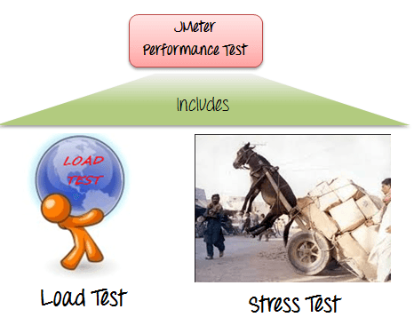
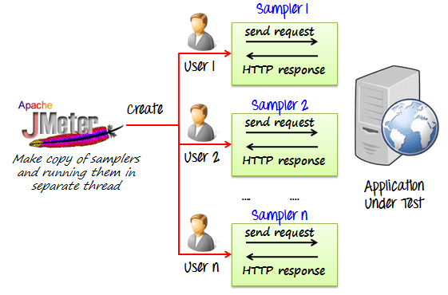
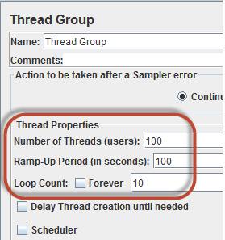
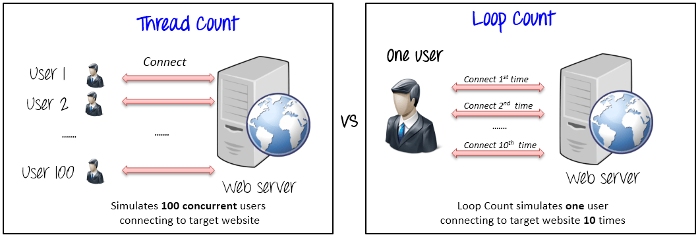
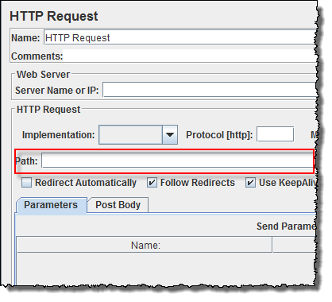
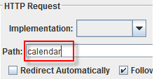
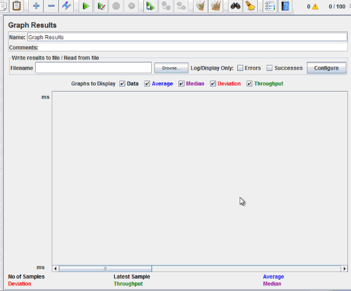
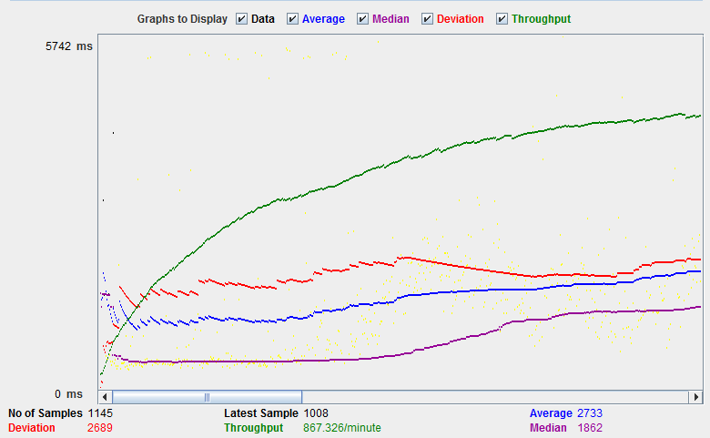

# 使用 Jmeter 性能测试

性能测试是至关重要的，用来确定测试的 Web 应用程序是否满足**高负载**要求，它可以用来分析整体服务器在重负载下的性能。

 
JMeter 性能测试有以下**好处**：

   - JMeter 可以用来测试**静态**资源的性能，比如 JavaScript 和 HTML，以及**动态**资源，如 JSP、servlet 和 AJAX。
   - JMeter 可以**发现**你的网站可以处理的最大并发用户数。
   - JMeter 提供了各种图形化的性能分析报告。

JMeter 性能测试包括：

   - **负载**测试：通过模拟多用户同时访问 Web 服务的表现。
   - **压力**测试：每一个 Web 服务器都有最大负载能力，当负载超出极限，Web 服务器开始响应缓慢并产生错误，压力测试的目的是找到 Web 服务器的最大负载。

下图显示了如何用 JMeter 模拟重负载：

### 在 Jmeter 创建性能测试计划 

在本教程中，我们用  1000 个用户在谷歌浏览器上做性能分析。

在测试目标 Web 应用程序的性能之前，我们应该确定：

   - **正常负载**：访问你网站的平均用户数
   - **沉重的负荷**：访问你网站的最大用户数
   - 在这个测试中你的**目标**是什么？

这里是这个实际例子的**路线图**：

### 步骤1)添加线程组

    1. 打开 JMeter
    2. 在列表里选择测试计划
    3. 添加线程组

右击测试计划并添加新线程组： **Add -> Threads (Users) -> Thread Group**。

在线程组控制面板中，输入线程属性如下：

   - **线程数量**： 100 (连接目标网站的用户数 ：100)
   - **循环计数**： 10 (执行测试的时间数 )
   - **过渡时期**： 100

线程数量和循环计数**不同**。

过渡时期告诉 JMeter 多久**延迟**后再开始下一个用户，例如，如果我们有 100 个用户和一个 100 秒的过渡时期，然后启动用户之间的延迟将是 1 秒 ( 100 用户/ 100 秒)。

### 步骤2)添加 JMeter 元素

现在我们确定 JMeter 元素在这个测试，这个元素是：

   - HTTP 请求违约

这个元素可以通过右键单击添加线程组和选择： **Add -> Config Element -> HTTP Request Defaults**。

在 HTTP 请求违约控制面板中，输入正在测试中的网站名称( [http://www.google.com ](http://www.google.com))。

   - HTTP 请求

右击 Thread Group 并选择： **Add -> Sampler -> HTTP Request**。

在 HTTP 请求的控制面板中，路径字段指示为要发送给谷歌服务的 **URL** 请求。

例如，如果你在路径字段输入“日历”，JMeter 将创建谷歌服务器的 URL 请求 [http://www.google.com/calendar](http://www.google.com )。

如果你保持路径字段为**空**，JMeter 将创建谷歌服务器的 URL 请求  [http://www.google.com](http://www.google.com)。

**在这个测试中，你保持路径字段为空，JMeter 将创建谷歌服务器的 URL 请求** [http://www.google.com](http://www.google.com)。

### 步骤3)添加图形结果

JMeter 可以以图形格式显示测试结果。

右击测试计划，**Add -> Listener -> Graph Results**。

### 步骤4)运行测试并获取测试结果

在工具栏按**运行键**（Ctrl + R）开始测试过程 ，你将看到测试结果实时显示在图表上。

下图给出了一个测试计划图，我们模拟了 100 个用户访问网站  [http://www.google.com](http://www.google.com)。

在图片的底部，有以下统计数据，用颜色表示：

   - 黑色：当前发送样品的总数
   - 蓝色的 ：当前发送样品的平均数
   - 红色的 ：当前的标准偏差
   - 绿色 ：表示服务器每分钟处理请求数量的吞吐率

下面的图片分析谷歌服务器的性能。

分析测试 Web 服务器的性能，你应该关注两个参数：

   - 吞吐量
   - 偏差

**吞吐量**是最重要的参数，它代表服务器处理重负载的能力，吞吐量越**高**，服务器性能越**好** 。

在该测试中，谷歌服务器的吞吐量是 1491.193 /分钟，这意味着谷歌服务器可以每分钟处理 1491.193个请求，这个值是比较高的，所以我们可以得出这样的结论：谷歌服务器具有良好的性能。

**偏差**以红色表示，表示偏离平均值，越**小**越**好**。

让谷歌服务器的性能与其他 Web 服务器进行比较，这是网站 [http://www.yahoo.com/](http://www.yahoo.com/)(你可以选择其他网站)的性能测试结果。

测试网站 [http://www.yahoo.com/](http://www.yahoo.com/) 的吞吐量是 867.326/分钟。 这意味着这个服务器每分钟处理 867.326 个请求，低于谷歌。

还有偏差是 2689，远远高于谷歌(577)。 所以我们可以确定这个网站的性能小于谷歌服务器。

**注意**： 上面的值取决于几个因素如当前服务器在谷歌的负载、你的网络速度、你的 CPU 等等。因此，很可能你会得到相同的结果，所以不要惊慌!

**故障排除** ：

如果您在运行上述方案时面临问题…… 请执行以下操作：

    1. 检查一下你是否通过代理连接到互联网，如果是，删除代理。
    2. 打开 JMeter 的一个新实例。
    3. 在 Jmeter 打开 PerformanceTestPlan.jmx。
    4. 双击线程组(Thread Group)- >图形结果(Graph Result)。
    5. 运行测试。
