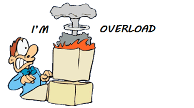
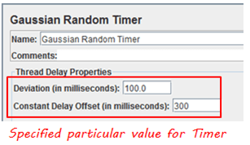
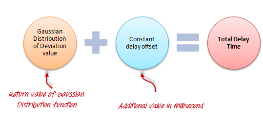
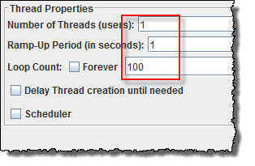
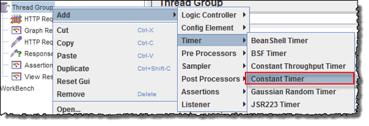
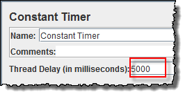
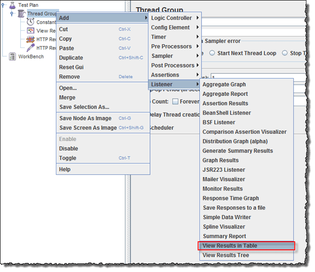
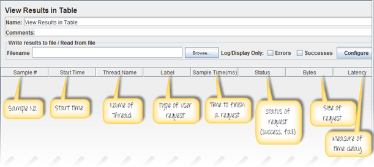
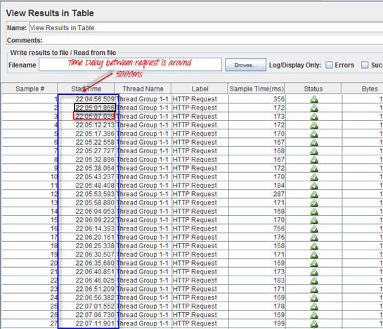
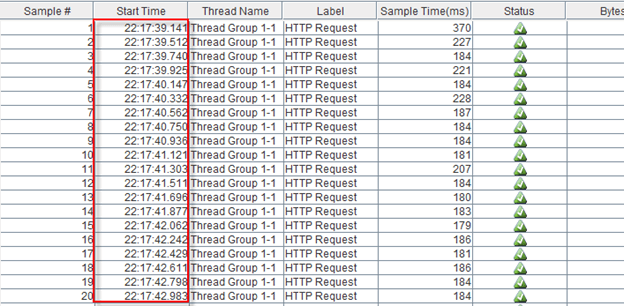

# 如何在 JMeter 内使用定时器 

默认情况下，JMeter 可以发送请求，且每个请求之间**没有停顿**， 但在这种情况下，在很短的时间内通过太多的请求 JMeter 可能会**压倒**你的测试服务器。

让我们想象一下，你在几秒钟内将**成千上万的请求**发送到正在测试中的 Web 服务器，这是发生了什么！

定时器允许 JMeter 发出的每个线程请求之间存在**延迟**，定时器可以解决服务器**过载**问题。

同样，在现实生活中访问者不会在同一时间到达一个网站，但在不同的时间间隔可以，所以计时器将有助于模拟实时行为。

以下是一些 JMeter **常见**类型的计时器

### 常数定时器：

常数定时器每个用户请求之间存在延迟的时间**相同**。

### 高斯随机定时器：

         高斯随机定时器每个用户请求的延迟时间随机。

### 参数：

| 属性      |     描述 |
|---------|---------------------------|
| 名字         | 显示在树中计时器的描述性名称|
| 偏差(毫秒) | 高斯分布函数的一个**参数** |
| 常数延迟偏移(毫秒)| **额外的**值以毫秒为单位|

 

所以总延迟描述如下图：

### 均匀随机定时器：

均匀随机定时器每个用户请求的延迟时间随机。

.png)

### 参数：

| 属性      |     描述 |
|---------|---------------------------|
| 名字         | 显示在树中计时器的描述性名称|
| 最大随机延迟 | 最大随机毫秒数 |
| 常数延迟偏移(毫秒)| **额外的**值以毫秒为单位|

**总延迟是随机值和偏移值之和。**

### BeanShell 定时器

BeanShell 定时器可用于**生成**每个用户请求之间的延迟时间。

### BSF 定时器

BSF 定时器可用于生成使用 BSF 每个用户请求之间延迟的脚本语言。

### JSR223 定时器

JSR233 定时器可用于生成使用 JSR233 每个用户请求之间延迟的脚本语言。
 
### 定时器设置的实际演示

在这个例子中，你会在谷歌浏览器上使用**常数定时器**设置用户请求之间的**固定延迟**。

我们从一个简单的测试脚本开始

   1. JMeter 将在 [http://www.google.com](http://www.google.com) 创建 **100** 个用户请求。
   2. 每个用户请求之间的延迟为 **5000 毫秒**。

这是这个例子的**路线图**：

## 前提条件：

我们**再次使用**教程 [JMeter 性能测试](http://www.guru99.com/jmeter-performance-testing.html)中的步骤 1 和步骤 2。

### 步骤 1)添加线程组

右击测试计划并添加新线程组： **Add -> Threads (Users) -> Thread Group**。

在线程组控制面板中，输入线程属性如下：

此设置允许 JMeter 在 [http://www.google.com](http://www.google.com) 创建 **100** 个用户请求。

### 步骤 2)添加 JMeter 元素

   - 添加 HTTP 请求违约
   - 添加 HTTP 请求
   
### 步骤 3)添加常数计时器

右击 **click Thread Group -> Timer -> Constant Timer**。

配置线程延迟 5000 毫秒。

### 步骤 4)在表中添加视图结果

打开视图结果步骤为：

右击 **click Add -> Listener -> View Result in Table**。

试图结果表显示如下图：

### 步骤 5)运行你的测试

当你准备**运行**测试时，单击菜单栏上的“运行”按钮，或按快捷键 **Ctrl + R**。

这是这个测试的结果

您可以分析结果如下：

一个样本的结束时间计算如下：

.png)

例如，在上面的图中，我们来分析**样本 2**

   - **开始时间**是 22：05：01.866
   - 样本 2 的**样本时间**为 172 毫秒
   - **常数定时器**：0 毫秒(配置)
   - 此示例的**结束时间** = 22：05：01.866 + 172 + 5000 = 22：05：07.038

所以样本 3 的开始时间应为 **22：05：07.039** (如上图所示)。

每个样本的**延迟**为 **5000 毫秒**。

如果你改变常量定时器为**零**，你会看到结果被改变。

我们来分析**样本 1**

   - **开始时间**是 22：17：39.141
   - 样本 2 的**样本时间**为 370 毫秒
   - **常数定时器**：0 毫秒(配置)
   - 此示例的**结束时间** = 22：17：39.141+ 370 + 0 = 22：17：39.511

所以**样本 2** 的开始时间应为 **22：17：39.512** (如上图所示)。

### 故障排除：

如果你在运行上述方案时面临问题…… 请执行以下操作：

   1. 检查一下你是否通过代理连接到互联网，如果是，删除代理。
   2. 打开 JMeter 的一个新实例。
   3. 在 Jmeter 打开 [TimerTestPlan.jmx](https://drive.google.com/uc?export=download&id=0B_vqvT0ovzHcUjJ5Vm1rN0g1ZlU)。
   4. 双击线程组(Thread Group) -> 查看结果表。
   5. 运行测试。

