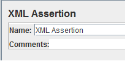
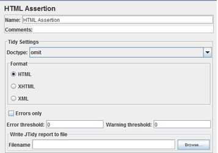
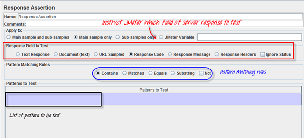
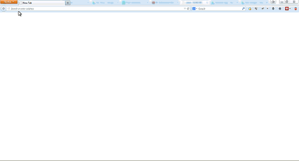
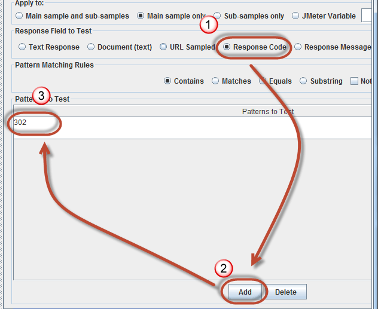
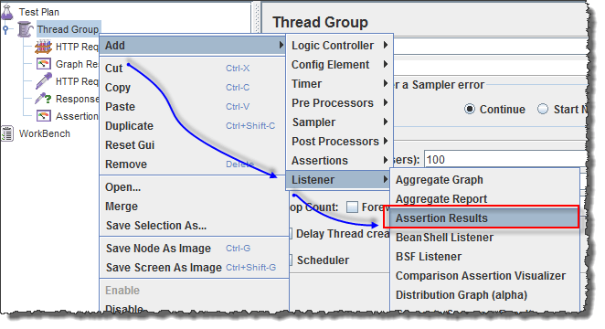
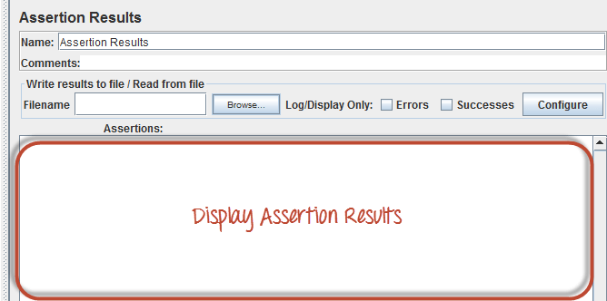

# 如何使用 JMeter 断言

断言帮助验证在测试中你的服务器是否返回**预期**的结果。

以下是一些常用 JMeter 的断言:
 
   - 响应断言(Response Assertion)
   - 持续时间断言(Duration Assertion)
   - 大小断言
   - XML 声明
   - HTML 断言

### 响应断言

响应断言允许你添加模式字符串与服务器响应的各个字段进行比较(模糊匹配)。

例如，你把一个用户请求发送到网站 [http://www.google.com](http://www.google.com) 并获取服务器响应，你可以使用响应断言来验证服务器响应是否**包含**预期的模式字符串(如：“确定”)。

### 持续时间断言

测试在**给定**的时间内是否可以接收到所有服务器响应的一个断言，若超过给定毫秒数的响应(由用户指定)将被标记为失败响应。

例如，从 JMeter 将一个用户请求发送到谷歌到得到响应的总时间在**预期**时间 5 毫秒内，则测试用例通过，否则测试用例失败。

### 大小断言  

大小断言测试，每个服务器响应包含它所期望的字节数，可以指定大小等于、大于、小于或等于给定的字节数。

JMeter 发送用户请求到谷歌获取字节规模小于**预期** 5000 字节的响应为测试用例通过，否则测试用例失败。

### XML 声明

xml 声明测试响应数据是由一个正式正确的 xml 文档组成的。

### HTML 断言

HTML 断言允许用户查看 HTML 语法的响应数据，这意味着响应数据必须满足 HTML 语法。

### Handson - Assertion

我们将继续早期教程 [JMeter 性能测试](http://www.guru99.com/jmeter-performance-testing.html)中脚本的开发。

在该测试中，我们使用的是**响应断言**来比较谷歌的响应数据包与你预期的字符串。

这是这个测试的**路线图**：

响应断言控制面板允许你将模式字符串添加到响应的各个字段进行比较。

### 步骤 1)添加响应断言

右击**线程组 -> Add -> Assertions -> Response Assertion**

响应断言窗格显示如下图:

### 步骤 2)添加模式

当你向谷歌服务器发送请求时，它可能会返回一些**响应代码**如下：

   - **404** ：服务器错误
   - **200** ：服务器 OK
   - **302** ：Web 重定向到其他页面，这通常发生在你访问美国谷歌浏览器后又重新定向到其他特定国家的网站时，如下图所示，印度的用户访问时会由 Google.com 重定向到 google.co.in。

假设你想验证 Web 服务器谷歌的响应代码包含模式 **302**，选中 **Response Field To Test** 区域内的**响应代码(Response Code)**，在响应断言面板上，单击 **Add** -> 显示一个新的空白输入框 -> 在模式测试(Pattern to Test)文本框内输入 **302**。

### 步骤 3)添加断言结果

**右击线程组(Thread Group) -> Add -> Listener -> Assertion Results**

### 步骤 4)运行你的测试

**点击 Thread Group -> Assertion Result**

当你准备运行测试，点击菜单栏上的**运行**按钮，或快捷键 **Ctrl + R**。

测试结果将显示在断言结果窗格内，如果谷歌服务器**响应代码**包含模式 **302**，则将**通过**测试用例。你将看到如下图所示的信息：

现在回到响应断言面板，你改变模式，将**模式测试(Pattern to Test)**文本框内容由 302 改为 500。

由于谷歌服务器响应代码不包含此模式，你将看到测试用例**失败**，如下图所示：

### 故障排除:

如果你在运行上述方案时面临问题…… 请执行以下操作:

   1. 检查一下你是否通过代理连接到互联网，如果是，删除代理。
   2. 打开 JMeter 的一个新实例。
   3. 在 Jmeter 打开 [AssertionTestPlan.jmx](https://drive.google.com/uc?export=download&id=0B_vqvT0ovzHcRkpra0EycUJNWE0)。
   4. 双击线程组(Thread Group) -> 断言结果(Assertion Result)。
   5. 运行测试。
