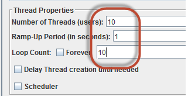
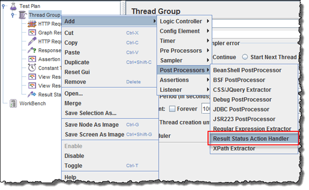
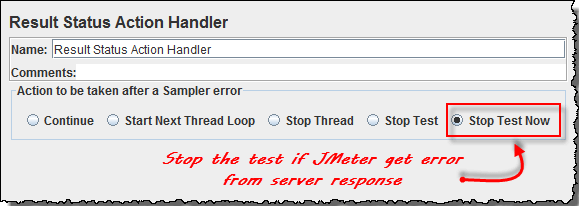
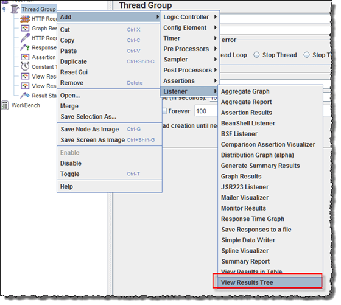
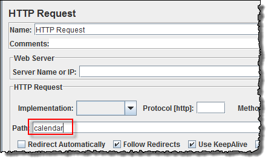

# 在 JMeter 如何使用处理器

处理器用来修改采样的范围。

有两种类型的处理器:

    1. 预处理器(Pre-processor)
    2. 后处理器(Post-processor)

**预处理器**：

预处理器执行一些动作**之前**要先采样请求。

如一个简单的例子：比如说你想要 JMeter “蜘蛛(spider)”通过网站下的测试，然后**解析**链接(检查网页上的所有链接)和**返回**的 HTML，你可以在创建一个 HTTP 请求之前添加一些如 “HTML 链接解析器”的控制器。

**后处理器**：

后处理器在执行采样请求后执行某些操作。

如一个简单的例子：JMeter 发送 HTTP 请求到 Web 服务器下(谷歌等)测试并得到响应，如果 jmeter 服务器响应错误，此时你要停止测试，你可以使用后处理器完成下列任务：

**手动操作处理器**

本教程将向你逐步演示说明如何使用 JMeter 的后处理器，我们从简单的测试脚本开始。

    1. JMeter 发送 HTTP 请求到 Web 测试服务器谷歌。
    2. JMeter 从谷歌服务器获取响应。
    3. 如果服务器响应错误，JMeter 会停止测试。
    4. 如果服务器响应无误，JMeter 会继续测试。

这是这个例子的**路线图**:

**前提条件**：

我们**调用** [JMeter 性能测试 ](http://www.guru99.com/jmeter-performance-testing.html)教程中的步骤 1、2。

### 步骤 1)添加线程组

右击测试计划并添加一个新的线程组：**Add -> Threads (Users) -> Thread Group**

但还要在线程组控制面板中，输入线程属性如下：

此设置允许 JMeter 创建 **10** 个用户请求在谷歌浏览器上跑 **10** 次。

### 步骤 2)添加 JMeter 元素

   - 添加 HTTP 请求违约
   - 添加 HTTP 请求

我们仍然让 JMeter 发送请求到谷歌服务器。

### 步骤 3)添加后处理器元素

右击 **Thread Group -> Add -> Post Processor -> Result Status Action Handler**

如果用户请求失败，**结果状态操作处理程序(Result Status Action Handler)**允许用户停止线程或整个测试。

在结果状态操作处理(Result Status Action Handle)窗口中，选择**现在停止测试(Stop Test Now)**，如果 JMeter 从服务器响应错误，这个选择将造成测试终止。

### 步骤 4)配置HTTP请求

打开 HTTP 请求面板，输入 **“abc”** 到路径(path)字段。

当你输入 **“abc”** 到路径(path)，JMeter 将创建 URL 请求([http://www.google.com/abc](http://www.google.com/abc))到谷歌服务器，但这个 URL 谷歌服务器上不存在，它是**错误的** URL 请求，所以谷歌服务器将返回错误。

### 步骤 5)添加视图结果树(View Result Tree)

右击 **Thread Group  -> Add  -> Listener  -> View Result Tree**

### 步骤 6)运行测试

点击视图结果树上菜单栏的运行按钮，你将看到谷歌服务器的**错误**响应，测试将停止完成这 100 个线程。

.gif)

现在返回到步骤 4，打开 HTTP 请求窗口，在 Path 中输入**“calendar”**，它使 JMeter 创建 URL 请求([http://www.google.com/calendar](http://www.google.com/calendar))到谷歌服务器，这是**正确的** URL 请求，所以谷歌服务器将返回 OK(没有错误)。

点击视图结果树上菜单栏的运行按钮，你将看到谷歌服务器返回 **OK** 响应并且测试继续，直到所有 100 个线程执行完毕。

.gif)

### 故障排除:

如果你在运行上述方案时面临问题…… 请执行以下操作:

   1. 检查一下你是否通过代理连接到互联网，如果是，删除代理。
   2. 打开 JMeter 的一个新实例。
   3. 在 Jmeter 打开 [ProcessorTestPlan.jmx](https://drive.google.com/uc?export=download&id=0B_vqvT0ovzHccFZlUG96ejE3YWM)。
   4. 双击线程组(Thread Group) -> 视图结果树(View Results Tree)。
   5. 运行测试。
