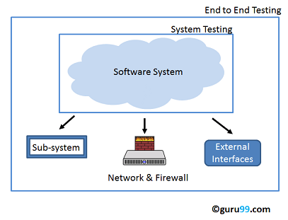
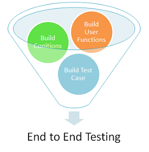

#端对端测试指南：完成E2E测试教程

##什么是端对端测试？

端对端测试一种不仅验证了软件的系统测试，同时也不忘与外部接口软件测试类型。因此，被称为“端对端”。端对端测试的目的是完成一个完整的生产场景。

随着软件系统，它也验证批次/数据处理从其他上游/下游系统。

端对端测试通常在功能和系统测试之后被执行。

它使用环境试验和模拟实时设定的实际生产数据等。端对端测试，也称为链测试

## 为什么进行端对端测试?

现代软件体系复杂且相互连接多个子系统。

一个子系统可以是不同于当前系统或属于另一组织。如果任何一个子系统出现故障，整个系统可能崩溃。这主要可以通过端对端测试来避免的主要风险。端对端测试验证系统的完整流动。提高了测试覆盖范围的各种子系统。这有助于在产品的整个软件中检测子系统的问题和增加信心。

## 端对端测试过程：

下图概述了端对端测试过程。

端到端测试的主要活动是—

- 研究的端对端测试要求
- 试验环境设置和硬件/软件要求
- 所有描述的系统和子系统的过程。
- 所有系统的角色和职责描述
- 试验方法和标准
- 端到端需求跟踪和测试案例的设计
- 每个系统的输入和输出数据

## 如何创造终端测试案例？

端对端测试的设计：

- 建立用户功能
- 建立条件
- 测试实例

让我们看看细节：

### 建立用户功能

下列活动应作为构建用户函数的一部分：

- 列出系统的特征及其相互关联的组件
- 列出输入数据、输出数据和所述动作的各特征或功能
- 识别函数之间的关系
- 确定函数是否可重用或独立

例如，考虑这样一个场景，你登录到你的银行账户，将钱转到其他银行的另一个账户（　3RD　子系统）

- 登录银行系统
- 检查账户余额
- 从你的账户转移一些金额到另一个银行账户(　3RD　第三方子系统)
- 检查注销

### 基于用户功能构建条件

下列活动作为生成条件的一部分执行：

- 针对每个用户定义函数构建条件
- 条件包括序列、定时和数据条件

例如，检查更多的条件

### 登录页面

- 无效的用户名和密码
- 用有效的用户名和密码
- 密码强度检查
- 检查的错误消息

### 余额

- 24小时后检查当前余额（如果转移到不同的银行）
- 如果传输金额大于当前余额，则检查错误消息。

### 构建测试场景

构建测试场景的用户定义函数

在这种情况下，

- 登录到系统中
- 检查银行余额
- 银行将余额转移

### 建立多个测试用例

为每个定义的场景构建一个或多个测试用例。测试用例可以将每个条件包括为单个测试用例。

## 端对端测试的度量：

以下是一些用于端对端测试的度量：

- 测试案例准备状态：它给测试案例编写进度计划
- 每周测试进度：提供测试完成的每周详细信息-失败的百分比，未执行和执行计划执行测试。
- 缺陷细节和状态-它给出了每周开放和关闭的缺陷的百分比。另外，周方向分布缺陷严重性和优先级
- 可用性环境：每天测试的总时数。

## 端对端测试与系统测试

| 端对端测试 | 系统试验 |
| :-------:|:--------:|
| 验证软件体系及互连子系统 | 根据需求规格验证软件系统　|
| 它检查完整的端到端处理流程 | 	检查系统的功能和特性 |
| 所有接口，后端系统将被考虑用于测试| 测试将考虑功能性和非功能性测试 |
| 系统测试完成后执行 | 集成测试后执行 |
| 端对端测试涉及检查复杂的自动化的外部接口 。因此手动测试是优选的。  | 手动和自动化执行系统测试 |

## 最后结果

端到端测试是对软件系统及其子系统进行验证的过程。在这个测试中最大的挑战是有足够的知识，整个系统以及互连子系统。