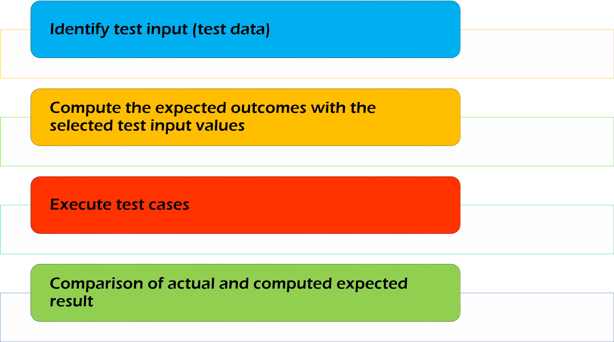

#功能性测试教程：定义、过程、类型、实例

## 功能测试是什么？

功能测试是验证了软件应用的每个功能都与需求规范一致的一种测试。本测试主要涉及黑盒测试，不涉及应用程序的源代码。

通过提供适当的输入，验证输出和比较的实际结果与预期的结果对每一个系统的功能进行测试。此测试包括检查用户界面、API、数据库、安全性、客户机/服务器应用程序以及正在测试的应用程序的功能。该测试可以手动或使用自动化进行。

## 你在功能测试中测试了什么？

功能测试的主要目的是检查软件系统的功能。它主要集中在

- 主流功能：测试应用中的主要功能
- 基本可用性：它包括基本可用性测试的系统。它检查用户是否可以没有任何困难的自由浏览屏幕。
- 可达性：检查系统的可达性用户 
- 误差条件用法：利用检测技术来检测错误条件，检查错误消息是否被适当的显示。

## 功能试验过程：

为了功能测试的应用程序，必须遵循以下步骤：

- 了解需求
- 输入数据识别测试（测试）
- 用选定的测试输入值计算预期结果 
- 执行测试案例  
- 比较实际的和计算的预期结果

## 功能性和非功能性测试：
| 功能测试  |	非功能性测试|
| :-----: | :-----:| 
| 功能测试时采用的功能规范以及该系统的功能要求。| 非功能性测试的性能、可靠性、可伸缩性和其他非功能方面的软件系统。|
| 功能测试首先被执行  | 功能测试后应进行非功能测试 |
| 手动测试或自动化工具可以用于功能性测试 | 使用工具可以有效地进行测试 |
| 功能测试的输入时业务需求  |	绩效参数，如速度、可扩展性被输入到非功能性测试。 |
| 功能测试描述产品是什么 	| 非功能性测试描述产品如何好 |
| 容易手动测试 | 做手工测试 |
| 被测试的功能类型:   单元测试   冒烟测试  健全测试   综合测试   白箱测试   黑箱测试   用户验收测试   回归测试 | 非功能性测试的类型:   性能测试   负载测试   体积测试   强度测试  安全测试  安装测试 渗透测试   兼容性测试   迁移测试 |

## 功能测试工具：

有几个标记的工具可用于执行功能测试。他们的解释如下：

- [Selenium](http://www.guru99.com/selenium-tutorial.html) - 流行的开源功能测试工具 
- [QTP](http://www.guru99.com/quick-test-professional-qtp-tutorial.html) - 非常方便用户的功能测试工具
- [JUnit](http://www.guru99.com/junit-tutorial.html) - 主要用于 java 应用程序，这可以用在单元和系统测试
- [soapUI](http://www.guru99.com/soapui-tutorial.html) -这是一个开源的功能测试工具，主要用于测试  Web 服务。它支持多种协议(例如 HTTP 、SOAP 和 JDBC）。
- Watir -这是用于 Web 应用程序的功能。它支持在 web 浏览器处执行测试，并且使用 Ruby 脚本语言

## 结论：

功能测试是测试系统功能的过程，并确保系统按照业务文档中指定的功能运行。这个测试的目的是检查系统是否功能完善！！！