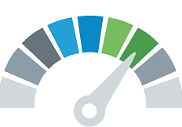

# 软件测试中的稳定性测试

## 稳定性测试是什么？

稳定性测试是产品是否能够继续起作用，随着时间和使用的全范围，而不会故障或引起故障。

这是一个非功能测试技术，其目的是强调软件组件的最大。在过程中，确定它如何执行负载下在可接受的水平，峰值负载，负载产生的尖峰，大量的卷数据进行处理，等等。

稳定性测试是为了验证产品的功效超出正常操作容量时，往往出现断点。**还有更大的意义**在错误处理中，软件的可靠性、健壮性和扩展性的产品，而不是重负载情况下，检查在正常情况下的系统行为。

稳定性测试也被称为负载或耐力测试。

在本教程中，您将学习-

- 为什么要做稳定性测试

- 测试策略或方法的基本方案是：

- CPU 性能稳定性测试的测试用例

- 稳定性试验的测试报告 

## 如果被测系统没有经过稳定性试验，会发生什么情况？

对于被测试的应用程序，大量的用户被引入，并且那些需要运行数月而不重新启动的应用程序可能会出现一些问题：

可能会遇到错误，

- 该系统变慢
- 遇到的问题系统功能
- 在有线系统行为
- 该系统完全崩溃

因此，稳定性测试通常涉及行使系统与大量的用户（虚拟）和测量的性能参数，以验证系统是否可以支持预期的负载。

## 为什么要做稳定性测试

这种测试有助于用户了解系统在现实生活中的工作方式。

因此，稳定性测试允许您检查，

- 对测试系统的稳定性提供信心。
- 确保系统可以处理大项目。
- 监控系统的有效性。
- 测试系统在应力下的稳定性。

它在产品开发中起着重要的作用，因为它是用来确定测试产品的局限性之前，它被释放或更完善的领域之前，去生活或生产产品。

稳定性测试技术的一个非常常见的例子是

在线购物网站：稳定性测试将检查网站将如何表现时 —

- 在高峰时间输入的大量数据
- 在某些特定的命中时间
- 页面加载时间指标
- 行为系统
- 系统的响应和更多的**稳定性测试**

## 另一个例子

**CPU** 测试是性能测试技术下一种流行的稳定性测试形式。此测试检查处理器的稳定性，并监测其性能，处理器的工作量增加。

## 上述方案的测试策略或基本方法：

- 要确定测试的范围和目标，我们必须确保应用服务器在加载测试执行期间不会崩溃。
- 确定业务问题，验证了系统性能和用户负载的端部透视图。
- 分配到不同的责任和角色创建测试计划、测试用例设计、测试用例、测试执行等等。
- 为了确保测试在规定时间内交付
- 为了确保适当的负载测试工具和经验团队是相同的。
- 测试中涉及的风险和成本。这将决定每个执行的 CPU 利用率和内存方面的成本。
- 确定缺陷跟踪和报告，并与需求进行适当的映射。

## CPU 性能稳定性测试的测试用例

- 为了验证系统的上限。
- 系统如何崩溃或恢复。
- 每个请求完成的事务总数。
- 交易响应是否随时间增大或保持平稳。
- 系统在重载下的行为。
- 重载下的响应与行为。

## 稳定性测试报告

一些统计信息被收集和测量测试期间执行；这些数据组被分析以生成报告，并查明可能的性能问题。

统计测试的例子是：

- **交易响应时间：**测试期间执行交易的平均时间。此统计将评估服务器的性能是否在系统中定义的可接受的最小和最大事务处理时间期间内。
   这些信息将评估 Web 服务器处理请求所花费的时间，并将其发送到应用服务器，在大多数情况下将向数据库服务器请求。

- **每秒命中：**用户在服务器上点击的次数。这个统计的好处，以确定负载用户生成的数量，相对于一些命中。
- **吞吐量：**在测试中以字节为单位的 web 服务器上的吞吐量。吞吐量指用户在任何给定时间从服务器接收到的数据量。这个统计有助于评估用户生成的负载量。
- **事务/秒：**这些是已完成的事务的总数(成功和失败)期间执行测试。这有助于以统计检查实际的事务负载的系统。
- **CPU：**CPU利用率百分比期间花费的测试。
- **存储器：**存储器测试期间使用。
- **盘：**使用盘空间期间花费的测试。

通过的时间，你现在可以容易地识别——

**稳定性测试**是在性能测试下进行的，这种技术是用来检查软件的一些质量属性，如稳定性、可靠性和可用性。

此测试用于确定在特定工作负载下系统或子系统执行的速度。

性能测试种类多，稳定性测试是其中之一。

- **强度测试：**它是一个测试类型的检验系统的坚固性(robustness)超出了系统容量。
- **尖峰测试：**用于检查的系统的行为由系统的负载的增加。目的在于检查在该点处，系统将具有性能问题，或将其旁路。
- **可伸缩性测试：**它使用的功能进行检查的系统。如何有效的系统将在需求增长、改变大小和体积变化。
- **体积测试：**它是一个非功能性测试技术，测试下的软件进行大量的数据，并且系统的行为被查实。
- **负载或稳定性测试**(上面已讨论)：

性能测试的一些工具，如 ——

- webload
- LoadRunner
- Apache JMeter
- neoload
- cloudtest
- loadstorm
- loadui
- wapt
- loadimpact
- loadster
- Httperf
- opensta
- 性能测试仪
- 任何测试

## 结论：

稳定性测试是一个非功能性的过程，测试应用程序的行为，通过施加最大负载。它是在一个给定的环境下，以了解系统的可扩展性。